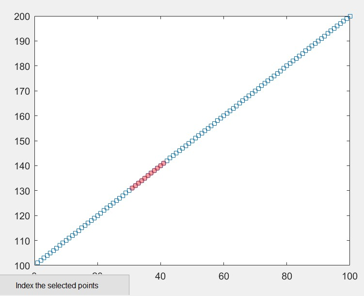

# MISCELLANEOUS MATLAB TOOLS
This repository contains miscellaneous tools that I have developed for data analysis in MATLAB.

---
## Interacting with Figure Data
**Folder:** interactive_find_data

`interactive_find_data.m`: This function plots x,y data inputs, allows the user to brush data points on the figure, and returns the x,y data brushed. This function calls the `callback` function (also included in this repository).

`interactive_delete_test_script.m`: This script provides an example case for the `interactive_find_data()` function.

---
## Batch Processing Template
**Folder:** load_multiple_files

`multi_file_load.m`: This script provides a simple template for loading in multiple files and can be used to facilitate batch data processing.

---
## Interpolation
**Folder:** data_interpolation

`interp_mat.m`: This function uses the built-in interp1() function to interpolate signals, which can be input as an array or matrix. You can also pass a method (e.g., linear, spline) into the function to alter interpolation method. 

`interp_example.m`: This script provides an example implimentation of `interp_mat.m`
